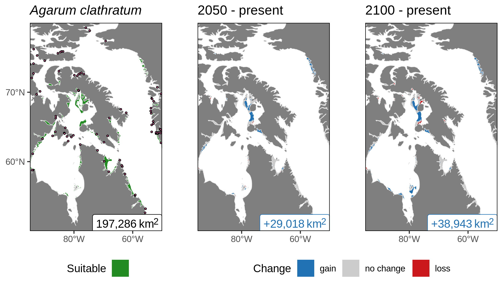

^1^Dalhousie University, Department of Oceanography, Halifax, Canada  
^2^Department de Biologié, Université Laval, Québec, Québec, Canada  
^3^Demersal and Benthic Sciences Division, Maurice-Lamontagne Institute, Fisheries and Oceans Canada, Mont-Joli, Québec, Canada  
^4^Arctic and Aquatic Research Division, Fisheries and Oceans Canada, Winnipeg, Manitoba, Canada  
^5^Institute of Marine Research, His, Norway  
^6^Center of Earth Observation Science, University of Manitoba, Winnipeg, Manitoba, Canada  
^7^Centre for Arctic Knowledge and Exploration, Canadian Museum of Nature, Ottawa, ON, Canada  

***

# State of the manuscript

- Should be ready for co-authors by end of April at the latest

***

# Methodology  {.tabset}

## Study area {-}

***

## Variables {-}

  

***

# Results {.tabset}

## Habitat suitability {-}

***

## Combined models {-}

***

# Journal?

- Is money an issue?
- Ecography
- Science of the Total Environment
- Diversity and Distributions

 
 
 
 
 
 
 
 