***

# What is known of Arctic kelps? {.tabset}

## Known

- Little is known of kelp in the Arctic

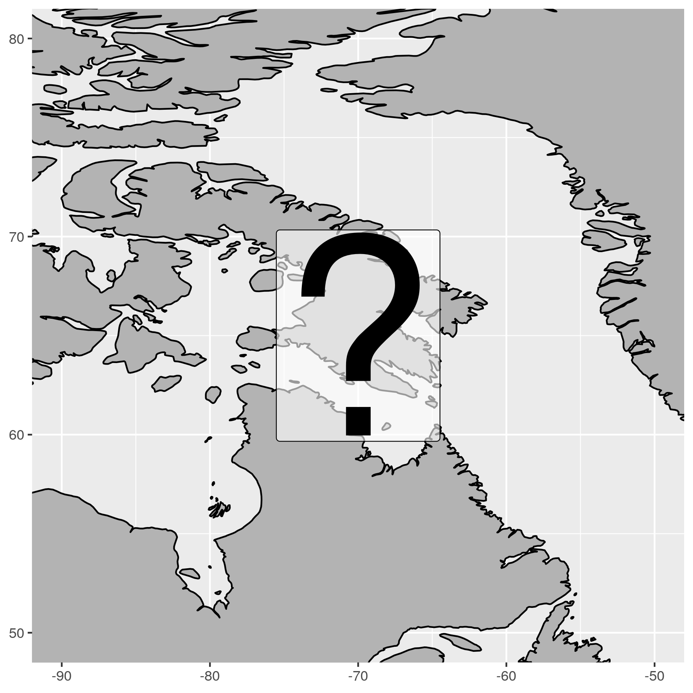

***

## Past

- Trading in Alaria along Baffin Island coast

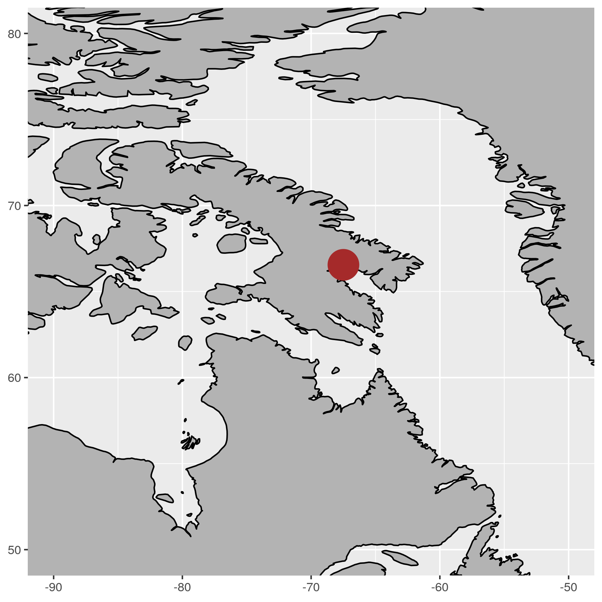

***

## Present

- There should be other Laminariales sp. ... but where?

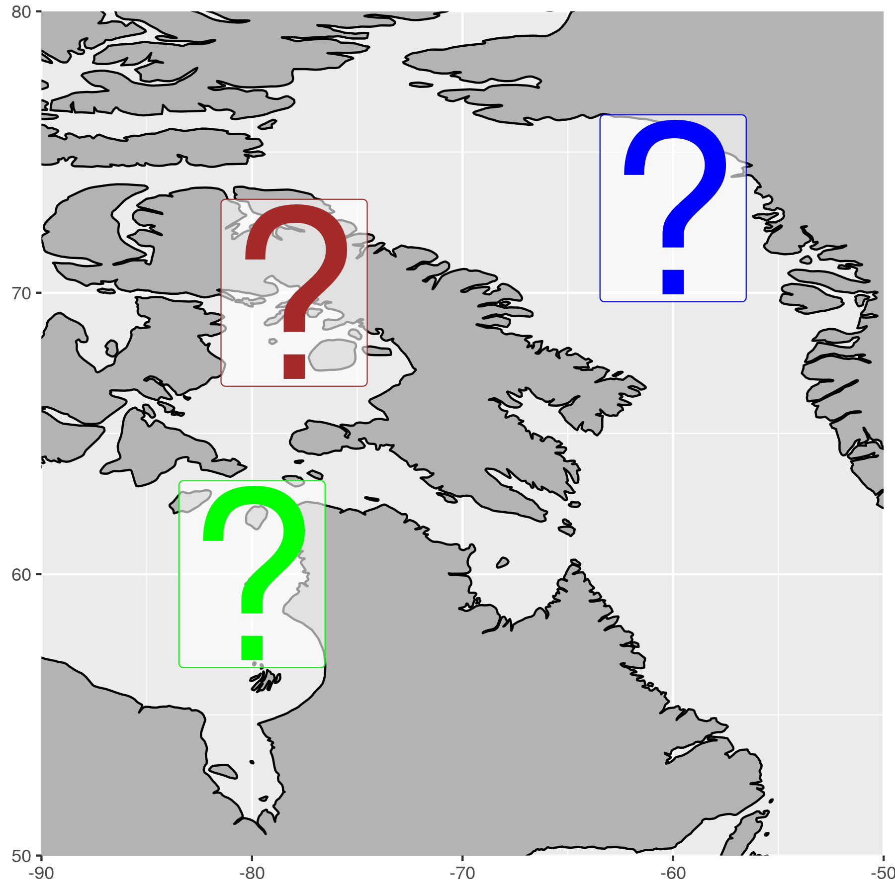

***

## Other

- RWS: Other examples?

***

# ArcticKelp project {.tabset}

- There must be kelp in the Arctic
- RWS: Bullet about what ArcticKelp seeks toa ccomplish
- We don't know what the drivers of their distributions are
- The Arctic is changing quickly so we should figure this out ASAP
- Where are kelp in the Arctic and what drives their distribution?
- Does this differ for different functional groups?
  - Total kelp cover
  - Laminariales (Laminaria sp. + Sacharina sp.)
  - Agarum
  - Alaria

## Campaigns

<!-- - Several different campaigns -->


***

## Sites

<!-- - Increasing ground truth obs -->
<!-- - Many sites visited -->


***

## Mean cover


***

# Environmental conditions {.tabset}

## Abiotic data

- NAPA (3-Oceans) model
  - Model outputs supplied by the Bedford Institute of Oceanography (BIO)  
  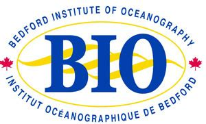{ width=20% }  
  - Based on the NEMO community ocean model  
  { width=20% }  
  [@Madec2015]  
  - Ice from the LIM3 model  
  { width=20% }  
  [@Vancoppenolle2009; @Rousset2015]  
  - Daily surface resolution: 1998 to 2015
  - Five day (pentad) resolution at 75 depth layers
  - Tri-polar grid
    - 10 to 20 km resolution  
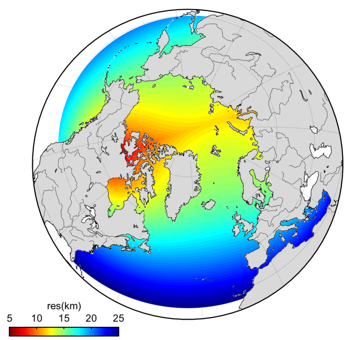{ width=40% }

***

## Biotic data

- Bio-ORACLE
  - 18 total geophysical, biotic and environmental variables
  - Surface and benthic coverage; min, mean, max, and range for most
  - Collection from many different datasets
  - 5 arcdegree spatial resolution (~9.2 km at the equator)

[@Tyberghein2012; @Assis2018b]  

***

# Modelling distribution {.tabset}

- Which variables are important?
- What is the accuracy of the model?
- What is the range in accuracy?
- What is the distribution of inaccuracy?

## Methods

- Highly correlated variables were removed
- A random forest model was used
- After many iterations the best variables were found
- These were used for many iterations to find the best model

## Variables {.tabset}

### Total kelp

```{r, echo=FALSE}
load("data/top_full_kelpcover.RData")
knitr::kable(x = top_full_kelpcover, format = "html")
```

***

### Laminariales

```{r, echo=FALSE}
load("data/top_full_laminariales.RData")
knitr::kable(x = top_full_laminariales, format = "html")
```

***

### Agarum

```{r, echo=FALSE}
load("data/top_full_agarum.RData")
knitr::kable(x = top_full_agarum, format = "html")
```

***

### Alaria

```{r, echo=FALSE}
load("data/top_full_alaria.RData")
knitr::kable(x = top_full_alaria, format = "html")
```

***

## Confidence {.tabset}

### Total cover

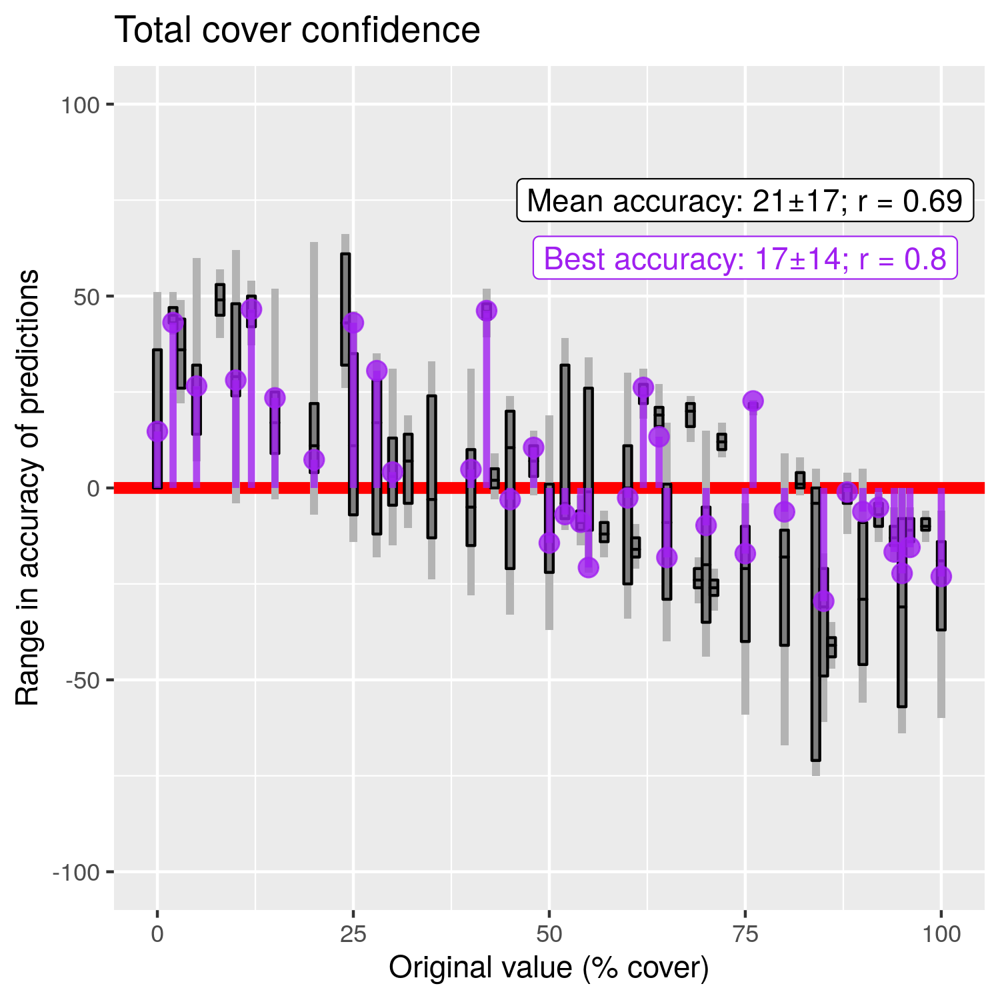

***

### Laminariales

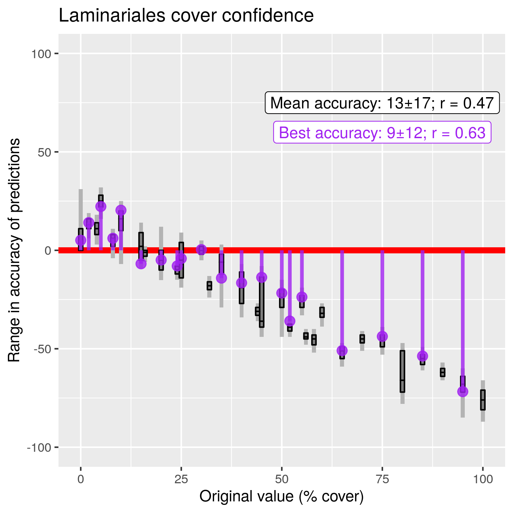

***

### Agarum

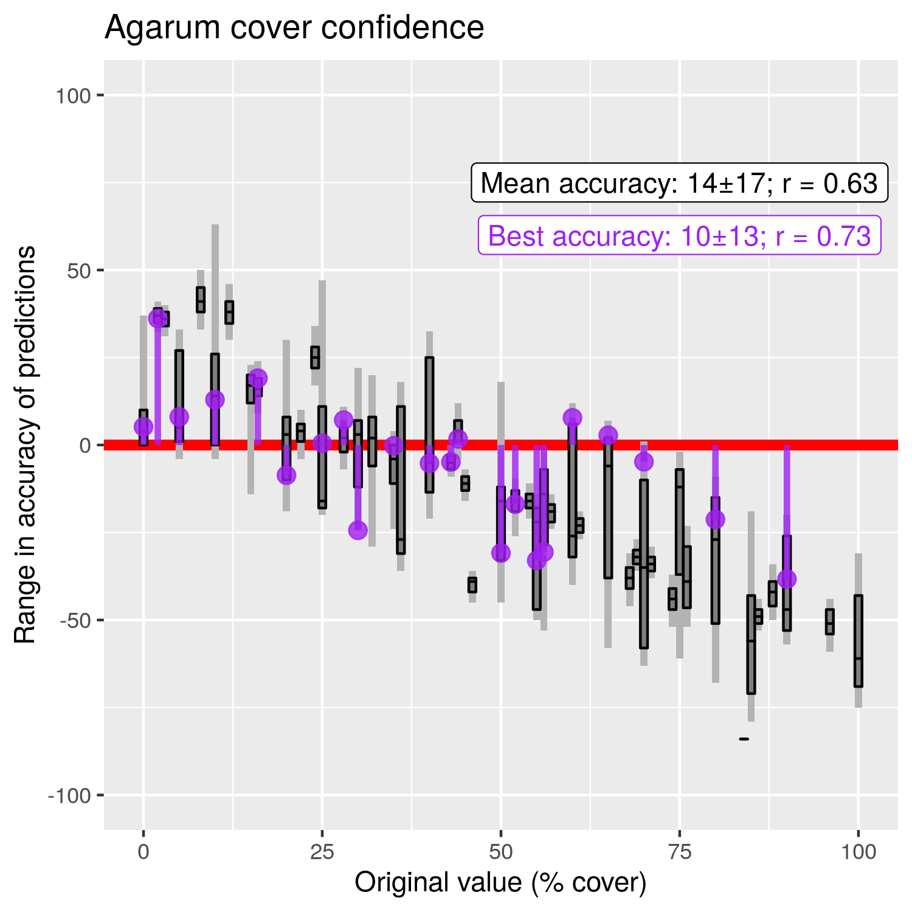

***

### Alaria

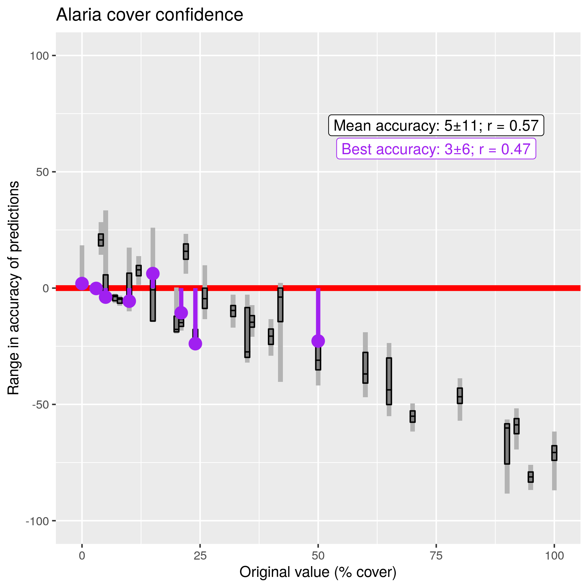

***

# Results {.tabset}

- Note that the colour scales are not the same between figures

## Total cover


***

## Laminariales

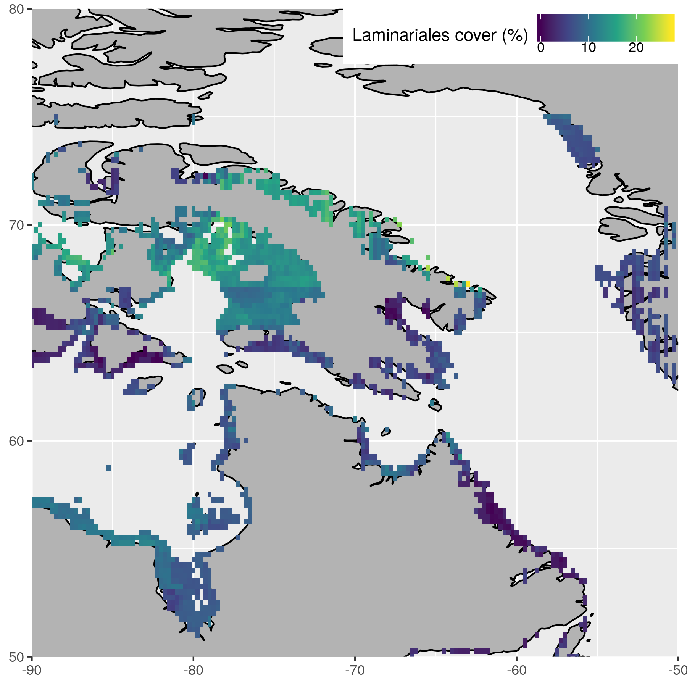

***

## Agarum

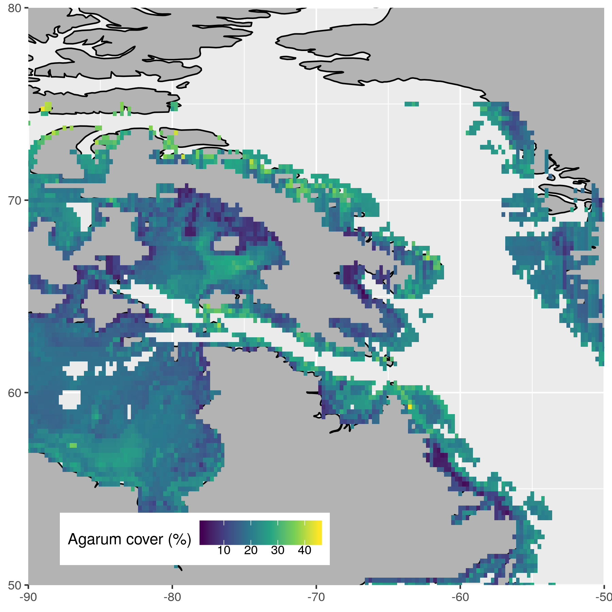

***

## Alaria

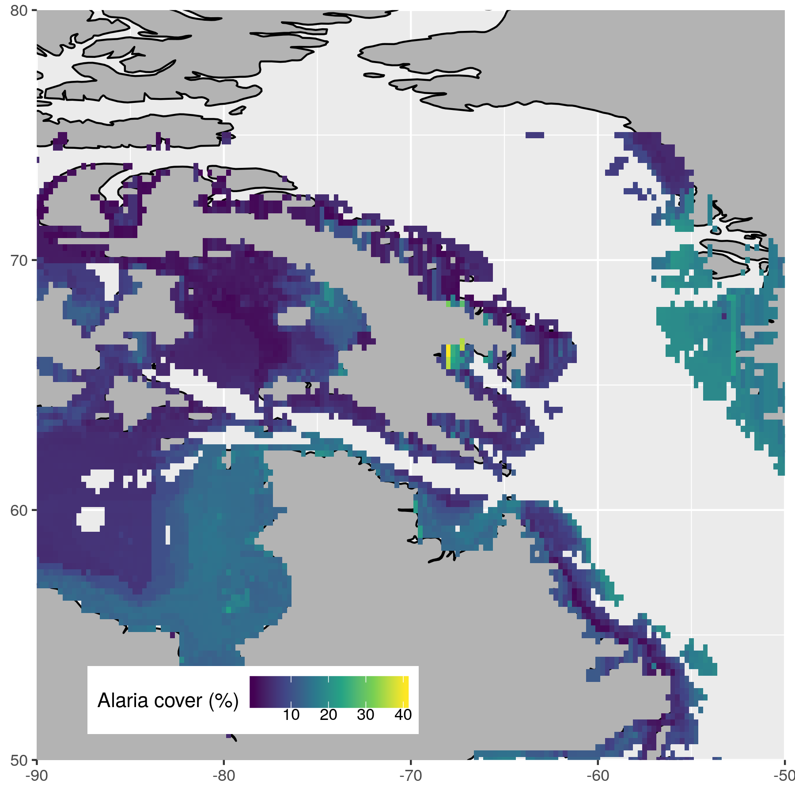

<!-- ## Coastal stretch -->
<!-- The thinking here was to show all of the coastal pixels as a histogram or something like that -->
<!-- Perhaps a histogram of depth <50 would be useful -->

***

# Acknowledgements

Dr. Youyu Lu and Dr. Xianmin Hu for NAPA model access

This research was undertaken thanks in part to funding from the Canada First Research Excellence Fund, through the Ocean Frontier Institute.  


***

# References