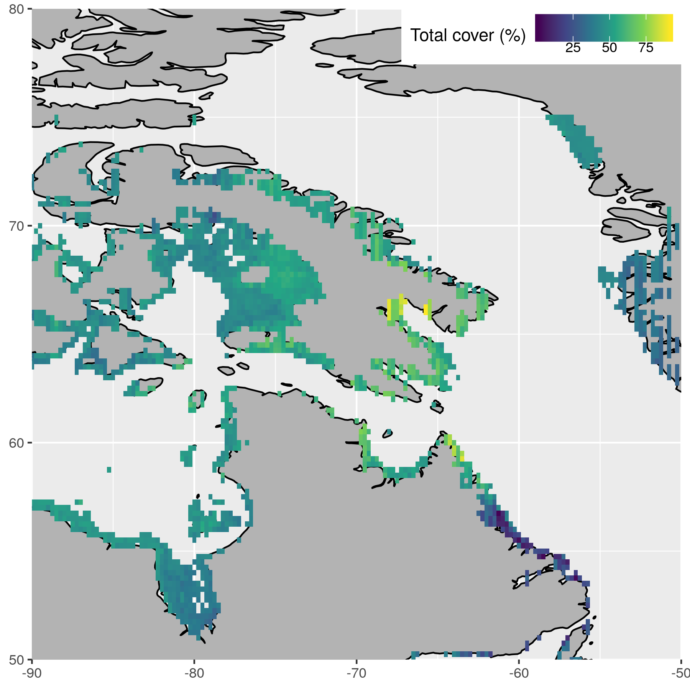
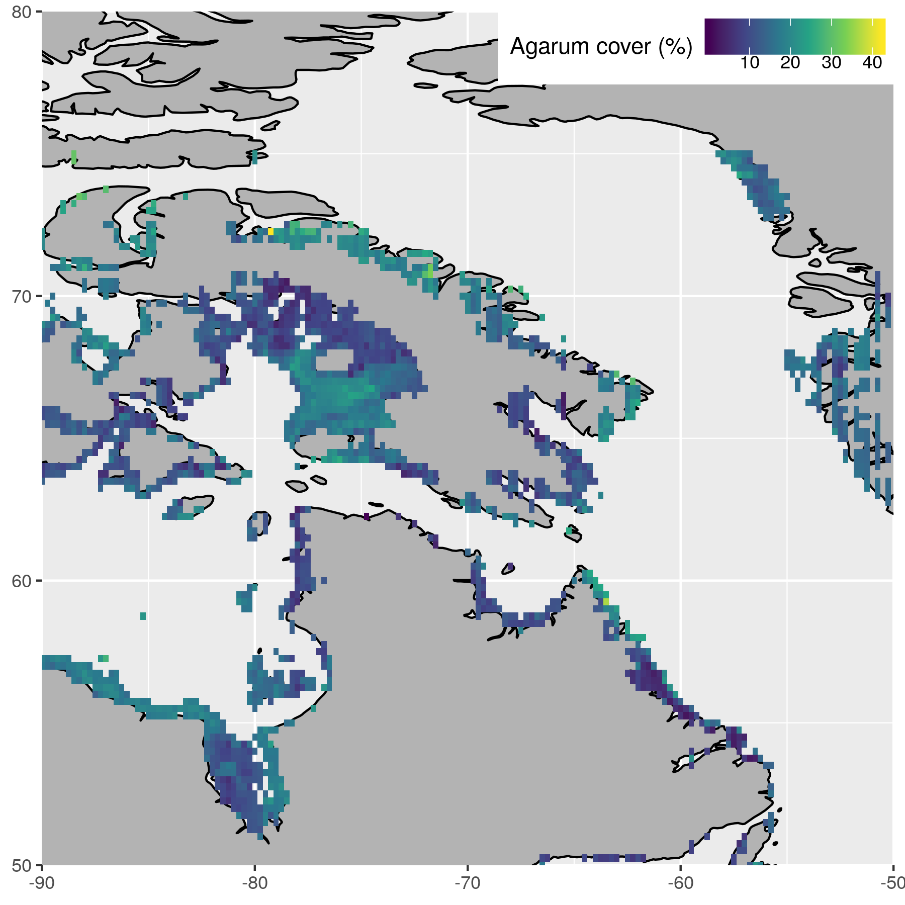

{ width=90% }

***

# What is known of Arctic kelps? {.tabset}

## Present

- Evidence suggests that many Arctic coasts should support seaweed
- In Canada, kelp has been reported and documented along Arctic and subarctic coastlines  
- However, baseline measures of the extent of kelp communities are missing in much of the region   

{ width=90% }

***

## Future

-  Rapid environmental changes, such as declining sea ice, increased ocean temperatures, and freshwater inputs are occurring along Canadian coasts 
- Research suggests northern expansion of kelp forests with climate change
- Therefore, the relationships between environmental factors and the presence of kelp forests in the Canadian Arctic are critical to understand 

{ width=90% }

<!-- <br> -->
<!-- <br> -->
<!-- <br> -->
<!-- <br> -->

***

# ArcticKelp project {.tabset}

<!-- SIMEP 2019: Saw that there is not as much soft-surface sediment as thought. Kelp forests there are as impressive as Ecklonia maxima. -->
<!-- PICKeR: Eclipse Sound 2019 was mostly Agarum dominated. -->
<!-- The amount of kelp cover in the Arctic is exceptionally higher than expected. -->
<!-- The Arctic is currently thought to be very nutrient deprived. How will the eroding of Arctic coastlines affect this? -->

<!-- - Where are kelp in the Arctic and what drives their distribution? -->
<!-- - The Arctic is changing quickly so we should figure this out ASAP -->

<!-- - Kelp abundance records (% cover by species) were obtained from ArcticKelp project -->

- This dive research conducted throughout the Canadian Arctic in 2014 - 2019 
    - 5 - 20 m photograph quadrats

## Campaigns

<!-- - Several different campaigns -->

{ width=90% }

<!-- *** -->

<!-- ## Sites -->

<!-- - Increasing ground truth obs -->
<!-- - Many sites visited -->

<!--  -->

***

## Mean cover
<!-- May also be good to show species and/or kelp cover range -->
{ width=90% }

***

## Question

- Do the environmental drivers of kelp distribution differ for different functional groups?
  - Total kelp cover
  - Laminariales (Laminaria sp. + Sacharina sp.)
  - Agarum
  - Alaria

***

# Environmental drivers {.tabset}

## Abiotic data

- NAPA (3-Oceans) model
  - Model outputs supplied by the Bedford Institute of Oceanography (BIO)  
  { width=10% }  
  - Based on the NEMO community ocean model [@Madec2015]    
  { width=10% }  
  - Ice from the LIM3 model [@Vancoppenolle2009; @Rousset2015]  
  { width=10% }  
  - Daily surface resolution: 1998 to 2015
  - Five day (pentad) resolution at 75 depth layers
  - Tri-polar grid
    - 10 to 20 km resolution  
{ width=20% }

***

## Biotic data

- Bio-ORACLE [@Tyberghein2012; @Assis2018b]  
  - Geophysical, biotic, and environmental variables
  - Collection from many different datasets
  - Surface and benthic coverage
  - Data from 2000 - 2014 for most
  - Single values per pixel; min, mean, max, and range for most
  - 5 arcdegree spatial resolution (~9.2 km at the equator)

<!-- <br>   -->
<!-- <br>   -->
<!-- <br>   -->
<!-- <br>   -->

***

# Modelling distribution {.tabset}

- Can we predict the % coverage of kelp groups?
- Which variables are important?
- What is the accuracy of the model?
- How do models differ between groups?

## Methods

- Highly correlated variables were removed
- The rest were fed to a random forest model [@Breiman2001]
- After many iterations the best variables were found
- These best variables were used over many iterations again to find the best models

<!-- <br> -->
<!-- <br> -->
<!-- <br> -->
<!-- <br> -->
<!-- <br> -->
<!-- <br> -->
<!-- <br>     -->
<!-- <br>   -->
<!-- <br>   -->

***

## Variables {.tabset}

<!-- Show top five and bottom five. Show the average Inc MSE/1000 -->

### Total kelp

```{r, echo=FALSE}
suppressMessages(library(magrittr))
load("data/top_full_kelpcover.RData")
knitr::kable(x = top_full_kelpcover, format = "html") %>%
  kableExtra::kable_styling(full_width = T, font_size = 20)
```

<!-- <br> -->
<!-- <br> -->
<!-- <br> -->
<!-- <br> -->

***

### Laminariales

```{r, echo=FALSE}
load("data/top_full_laminariales.RData")
knitr::kable(x = top_full_laminariales, format = "html") %>%
  kableExtra::kable_styling(full_width = T, font_size = 20)
```

<!-- <br> -->
<!-- <br> -->
<!-- <br> -->
<!-- <br> -->

***

### Agarum

```{r, echo=FALSE}
load("data/top_full_agarum.RData")
knitr::kable(x = top_full_agarum, format = "html") %>%
  kableExtra::kable_styling(full_width = T, font_size = 20)
```

<!-- <br> -->
<!-- <br> -->
<!-- <br> -->
<!-- <br> -->

***

### Alaria

```{r, echo=FALSE}
load("data/top_full_alaria.RData")
knitr::kable(x = top_full_alaria, format = "html") %>%
  kableExtra::kable_styling(full_width = T, font_size = 20)
```

<!-- <br> -->
<!-- <br> -->
<!-- <br> -->
<!-- <br> -->

***

## Confidence {.tabset}

### Total cover

{ width=90% }

***

### Laminariales

{ width=90% }

***

### Agarum

{ width=90% }

***

### Alaria

{ width=90% }

***

# Results {.tabset}

- Note that the colour scales are not the same between figures

## Total cover

{ width=90% }

***

## Laminariales

{ width=90% }

***

## Agarum

{ width=90% }

***

## Alaria

{ width=90% }

<!-- ## Coastal stretch -->
<!-- The thinking here was to show all of the coastal pixels as a histogram or something like that -->
<!-- Perhaps a histogram of depth <50 would be useful -->

***

# Conclusions

- There should be quite a lot of kelp in the Arctic
- There are different spatial projections for different groups
- Alaria projections are likely incorrect and require more data
- These projections provide a good platform for deciding future sampling locations

***

# Further work

- Better screening of variables used in model
- More thorough model testing
- Increase resolution of data
- Introduce substrate data

***

# Acknowledgements

- Dr. Youyu Lu and Dr. Xianmin Hu for NAPA model access

- This research was undertaken thanks in part to funding from the Canada First Research Excellence Fund, through the Ocean Frontier Institute.  
  
{ width=50% }  
  
***

# References