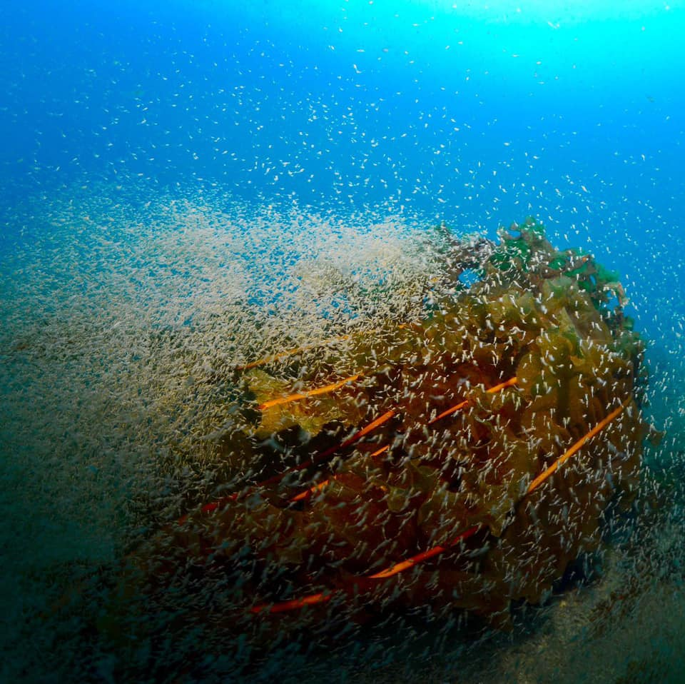
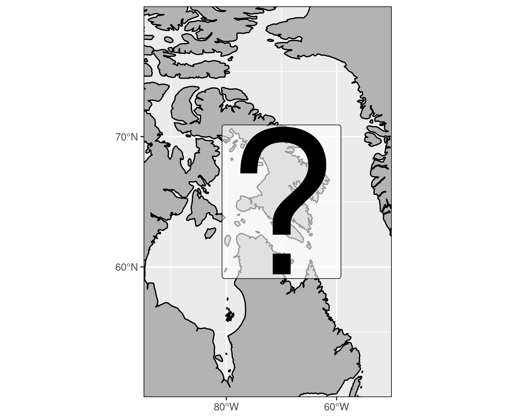
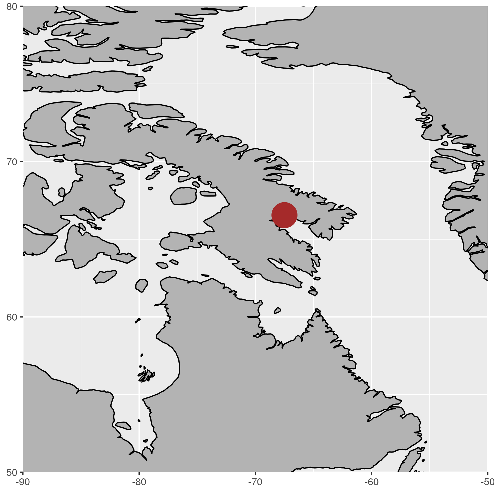

***

# What is known of Arctic kelps? {.tabset}

## Known

- Little is known of kelp in the Arctic



***

## Past

- Trading in Alaria along Baffin Island coast



***

## Present

- There should be other Laminariales sp.


***

## Other

- RWS: Other examples?

***

# ArcticKelp project {.tabset}

- There must be kelp in the Arctic
- We don't know what the drivers of their distributions are
- The Arctic is changing quickly so we should figure this out ASAP
-  Where are kelp in the Arctic and what drives their distribution?

## Campaigns

<!-- - Several different campaigns -->


***

## Sites

<!-- - Increasing ground truth obs -->
<!-- - Many sites visited -->


***

## Mean cover


***

# Environmental conditions {.tabset}

## Abiotic data

- NAPA (3-Oceans) model
  - Model outputs supplied by the Bedford Institute of Oceanography (BIO) 
  { width=20% }
  - Based on the NEMO community ocean model 
  { width=20% }
  - Daily surface resolution; 1998 to 2015
  - Five day (pentad) resolution at 75 depth layers
  - Tri-polar grid
    - 10 to 20 km resolution
{ width=40% }

***

## Biotic data

- Bio-ORACLE
  - Collection of many different datasets
  - Most variables constrained to a 25km resolution
@Tyberghein2012  
@Assis2018b  

***

# Modelling distribution {.tabset}

- A random forest model was used
- Which variables are important?
- What is the accuracy of the model?
- What is the range in accuracy?
- What is the distribution of inaccuracy?

## Variables

```{r, echo=FALSE}
load("data/top_full_kelpcover.RData")
knitr::kable(x = top_full_kelpcover, format = "html")
```


## Confidence {.tabset}

### Total cover


### Laminariales


### Agarum


### Alaria


***

# Results {.tabset}

KFB: Show general kelp cover
KFB: Drop Alaria if necessary

- Note that the colour scales are not the same between figures

## Total cover


## Laminariales


## Agarum


## Alaria


<!-- ## Coastal stretch -->
<!-- The thinking here was to show all of the coastal pixels as a histogram or something like that -->
<!-- Perhaps a histogram of depth <50 would be useful -->

***

# Acknowledgements

Dr. Youyu Lu and Dr. Xianmin Hu for NAPA model access

This research was undertaken thanks in part to funding from the Canada First Research Excellence Fund, through the Ocean Frontier Institute.


***

# References