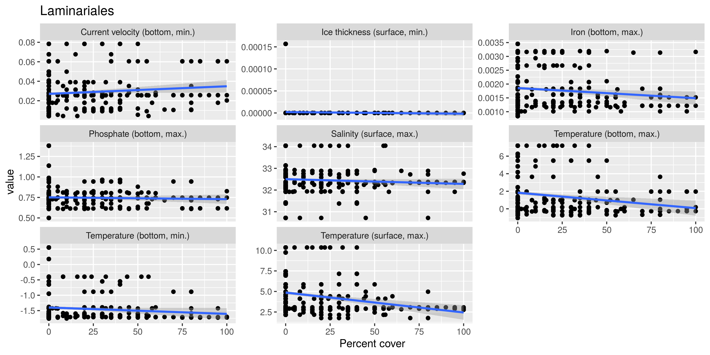
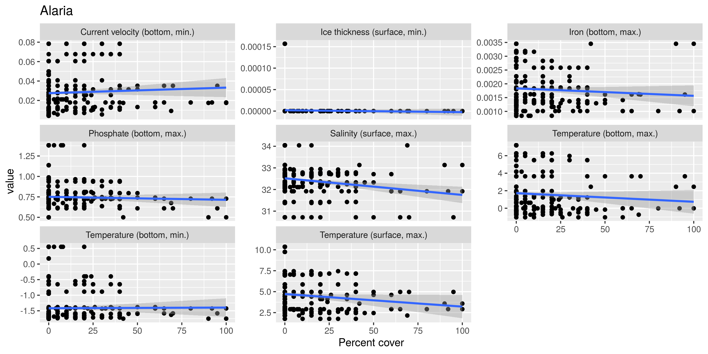

^1^Dalhousie University, Department of Oceanography, Halifax, Canada  
^2^Department de Biologié, Université Laval, Québec, Québec, Canada  
^3^Demersal and Benthic Sciences Division, Maurice-Lamontagne Institute, Fisheries and Oceans Canada, Mont-Joli, Québec, Canada  
^4^Arctic and Aquatic Research Division, Fisheries and Oceans Canada, Winnipeg, Manitoba, Canada  
^5^Institute of Marine Research, His, Norway  
^6^Center of Earth Observation Science, University of Manitoba, Winnipeg, Manitoba, Canada  
^7^Centre for Arctic Knowledge and Exploration, Canadian Museum of Nature, Ottawa, ON, Canada  

***

# Introduction

## Current knowledge

### Present

- Evidence suggests that many Arctic coasts should support seaweed
- In Canada, kelp has been reported and documented along Arctic and subarctic coastlines  
- However, baseline measures of the extent of kelp communities are missing in much of the region  

### Future

- Rapid environmental changes, such as declining sea ice, increased ocean temperatures, and freshwater inputs are occurring along Canadian coasts 
- Research suggests northern expansion of kelp forests with climate change
- Therefore, the relationships between environmental factors and the presence of kelp forests in the Canadian Arctic are critical to understand 

### Existing database

- Canadian Museum of Nature (CANA)
- Global Biodiversity Information Facility (GBIF; www.gbif.org)
- Ocean Biogeographic Information System (OBIS; www.obis.org) 
- Literature [@Borum2002; @Hop2016; @Schoenrock2018; @Filbee2019; @Ronowicz2020]
- ArcticKelp project

### ArcticKelp project {.tabset}

{ width=100% }

- Dive research conducted throughout the Canadian Arctic in 2014 - 2019 
    - 5 - 20 m photograph quadrats

#### Campaigns

{ width=90% }

#### Mean cover

{ width=90% }

## Questions

- Is it possible to model the distribution (suitability + abundance) of different functional groups of kelps in the Arctic given our current knowledge?
  <!-- - Total kelp cover -->
  - Laminariales (_Laminaria_ sp. + _Sacharina_ sp.)
  - _Agarum_
  - _Alaria_
- How accurate are the models?
- Which environmental variables are the most important?
- What do present + future distributions look like?

***

# Methods

## Study region

{ width=100% }

## Environmental data {.tabset}

{ width=90% }  
[@Tyberghein2012; @Assis2018b]  

### Bio-ORACLE
- Geophysical, biotic, and abiotic environmental variables
- Collection from many different datasets
- Surface and benthic coverage
- Data from 2000 - 2014 for most
- Single values per pixel: min, mean, max, and range for most
- 5 arcdegree spatial resolution (~9.2 km at the equator)

### Variables (32)
- Temperature
- Salinity
- Ice thickness (surface only)
- Current velocity
- Photosynthetically active radiation (PAR; surface only)
- Dissolved oxygen
- Iron
- Nitrate
- Phosphate

### Final variables (8)

- Bottom temperature; long-term minimum
- Bottom temperature; long-term maximum
- Surface temperature; long-term maximum
- Surface salinity; long-term maximum
- Ice thickness; long-term minimum
- Bottom iron; long-term maximum
- Bottom phosphate; long-term maximum
- Bottom current velocity; long-term minimum

### Future variables (6)

- Bottom temperature; long-term minimum
- Bottom temperature; long-term maximum
- Surface temperature; long-term maximum
- Bottom salinity; long-term maximum
- Ice thickness; long-term minimum
- Bottom current velocity; long-term minimum

## Ensemble model (suitability)

- Presnce data
- Ensemble performed with default BIOMOD2 R package settings [@biomod2020]  
- Models: MAXENT (Phillips), GLM, ANN, RF, GAM [@Goldsmit2020]  
- Random pseudo-absence (PA); 1000 points; 5 repetitions  
- 70/30 train test split  
- 0.7 TSS cutoff  
- Modeled for entire Arctic ecoregion  
- Results cropped to Eastern Canadian Arctic  

## Random forest model (abundance)

- Percent cover data
- 200 trees; 1000 repetitions  
- 70/30 train test split  
- Modeled only for Eastern Canadian Arctic

***

# Results {.tabset}

## Ensemble {.tabset}

### Confidence {.tabset -}

#### Laminariales {.tabset -}

##### _digitata_ {-}

{ width=100% }

***

##### _solidungula_ {-}

{ width=100% }

***

##### _latissima_ {-}

{ width=100% }

***

#### _Agarum_ {-}

{ width=90% }

***

#### _Alaria_ {-}

{ width=90% }

***

### Variables {.tabset -}

#### Laminariales {.tabset -}

##### _digitata_ {-}

```{r, echo=FALSE, message=FALSE, warning=FALSE}
library(dplyr)
load("data/var_imp_ensemble_Ldig.RData")
knitr::kable(x = var_import, format = "html") %>%
  kableExtra::kable_styling(full_width = T, font_size = 20)
```

***

##### _solidungula_ {-}

```{r, echo=FALSE, message=FALSE, warning=FALSE}
load("data/var_imp_ensemble_Lsol.RData")
knitr::kable(x = var_import, format = "html") %>%
  kableExtra::kable_styling(full_width = T, font_size = 20)
```

***

##### _latissima_ {-}

```{r, echo=FALSE, message=FALSE, warning=FALSE}
load("data/var_imp_ensemble_Slat.RData")
knitr::kable(x = var_import, format = "html") %>%
  kableExtra::kable_styling(full_width = T, font_size = 20)
```

***

#### _Agarum_  {-}

```{r, echo=FALSE}
load("data/var_imp_ensemble_Acla.RData")
knitr::kable(x = var_import, format = "html") %>%
  kableExtra::kable_styling(full_width = T, font_size = 20)
```

***

#### _Alaria_  {-}

```{r, echo=FALSE}
load("data/var_imp_ensemble_Aesc.RData")
knitr::kable(x = var_import, format = "html") %>%
  kableExtra::kable_styling(full_width = T, font_size = 20)
```

***

### Projections {.tabset -}

#### Laminariales {.tabset -}

##### _digitata_ {-}

{ width=100% }

***

##### _solidungula_ {-}

{ width=100% }

***

##### _latissima_ {-}

{ width=100% }

***

#### _Agarum_ {-}

{ width=100% }

***

#### _Alaria_ {-}

{ width=100% }

***

## Random Forest {.tabset}

### Confidence {.tabset -}

#### Laminariales {-}

{ width=90% }

***

#### _Agarum_ {-}

{ width=90% }

***

#### _Alaria_ {-}

{ width=90% }

***

<!-- #### Total cover -->

<!-- { width=90% } -->

### Variables {.tabset -}

#### Laminariales {-}

```{r, echo=FALSE, message=FALSE, warning=FALSE}
library(dplyr)
load("data/var_imp_RF_laminariales.RData")
knitr::kable(x = var_imp_RF_laminariales, format = "html") %>%
  kableExtra::kable_styling(full_width = T, font_size = 20)
```

***

#### _Agarum_ {-}

```{r, echo=FALSE}
load("data/var_imp_RF_agarum.RData")
knitr::kable(x = var_imp_RF_agarum, format = "html") %>%
  kableExtra::kable_styling(full_width = T, font_size = 20)
```

***

#### _Alaria_ {-}

```{r, echo=FALSE}
load("data/var_imp_RF_alaria.RData")
knitr::kable(x = var_imp_RF_alaria, format = "html") %>%
  kableExtra::kable_styling(full_width = T, font_size = 20)
```

***

<!-- #### Total kelp -->

<!-- ```{r, echo=FALSE} -->
<!-- suppressMessages(library(magrittr)) -->
<!-- load("data/top_full_kelpcover.RData") -->
<!-- knitr::kable(x = top_full_kelpcover, format = "html") %>% -->
<!--   kableExtra::kable_styling(full_width = T, font_size = 20) -->
<!-- ``` -->

### Projections {.tabset -}

#### Laminariales {-}

{ width=100% }

***

#### _Agarum_ {-}

{ width=100% }

***

#### _Alaria_ {-}

{ width=100% }

***

<!-- #### Total cover -->

<!-- { width=90% } -->

# Conclusions

- Confidence in MAXENT models in the ensembles is low
- Random forests tend to underestimate large values, and overestimate small ones
- Temperature is usually one of the most important variables for both models
- Ice is always the least important for the random forest
- Laminariales are projected to decline in the future in both models
- _Agarum_ and _Alaria_ show a mix of increase and decline in both models
- These projections provide a good platform for deciding future sampling locations

***

# Further work

- Improve MAXENT models
- More experimentation with variable choice
- Comparisons of ensemble and random forest outputs

***

# Acknowledgements

- This research was undertaken thanks in part to funding from the Canada First Research Excellence Fund, through the Ocean Frontier Institute.  
<br>
  
{ width=50% }  

***

# Questions ? {.tabset}

## Alaria {-}

{ width=70% }

***

## Linear regression {.tabset -}

### Laminariales {-}

{ width=100% }

***

### _Agarum_ {-}

{ width=100% }

***

### _Alaria_ {-}

{ width=100% }

***

# References