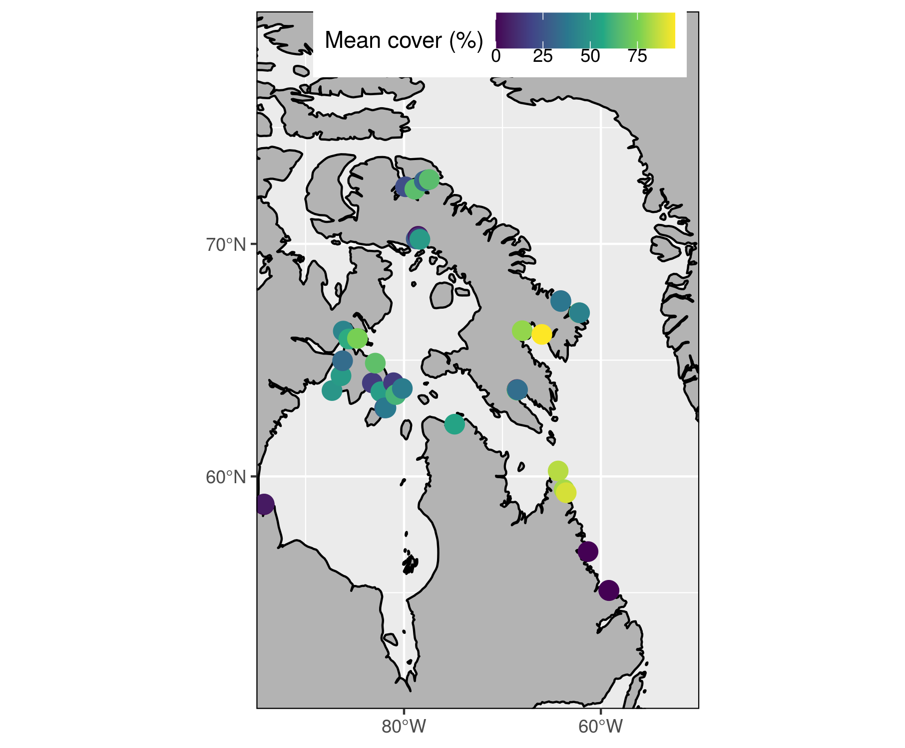
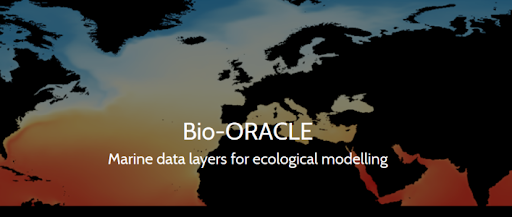
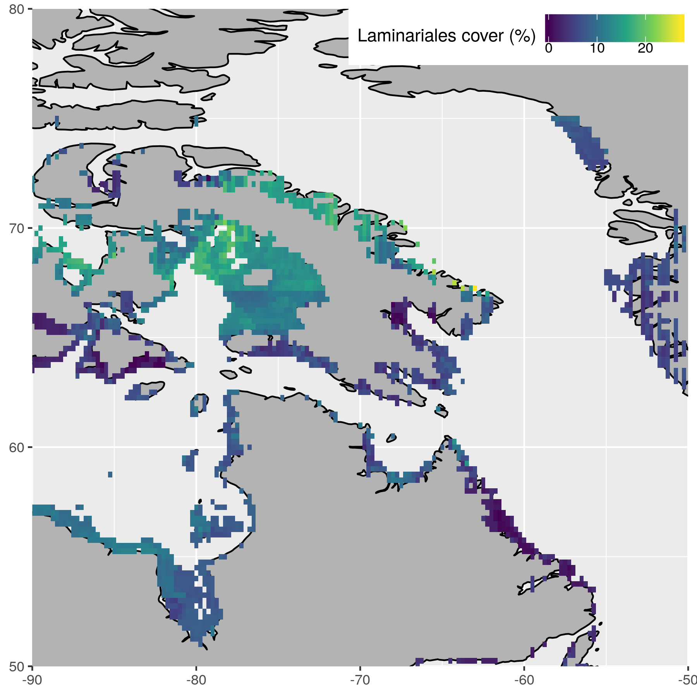
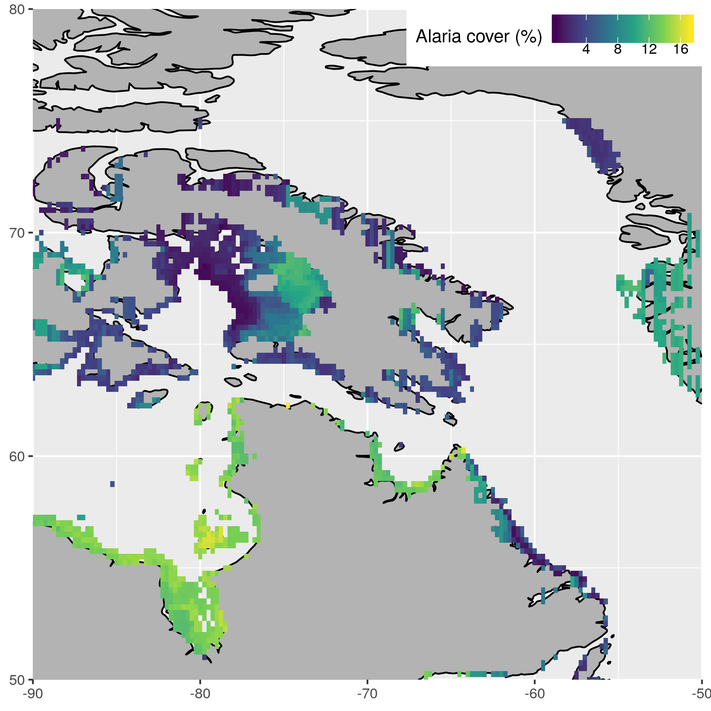

^1^Dalhousie University, Department of Oceanography, Halifax, Canada  
^2^Department de Biologié, Université Laval, Québec, Québec, Canada  
^3^Demersal and Benthic Sciences Division, Maurice-Lamontagne Institute, Fisheries and Oceans Canada, Mont-Joli, Québec, Canada  
^4^Arctic and Aquatic Research Division, Fisheries and Oceans Canada, Winnipeg, Manitoba, Canada  
^5^Institute of Marine Research, His, Norway  
^6^Center of Earth Observation Science, University of Manitoba, Winnipeg, Manitoba, Canada  
^7^Centre for Arctic Knowledge and Exploration, Canadian Museum of Nature, Ottawa, ON, Canada  

{ width=100% }

***

# Introduction

## Current knowledge

### Present

- Evidence suggests that many Arctic coasts should support seaweed
- In Canada, kelp has been reported and documented along Arctic and subarctic coastlines  
- However, baseline measures of the extent of kelp communities are missing in much of the region  

### Future

- Rapid environmental changes, such as declining sea ice, increased ocean temperatures, and freshwater inputs are occurring along Canadian coasts 
- Research suggests northern expansion of kelp forests with climate change
- Therefore, the relationships between environmental factors and the presence of kelp forests in the Canadian Arctic are critical to understand 

### Existing database

{ width=90% }

### _Arctic_**Kelp** project{.tabset}

- This dive research conducted throughout the Canadian Arctic in 2014 - 2019 
    - 5 - 20 m photograph quadrats

#### Campaigns

{ width=90% }

***

#### Mean cover

{ width=90% }

***

## Questions

- Is it possible to model the distribution (suitability + abundance) of different functional groups of kelps in the Arctic given our current knowledge?
  - Total kelp cover
  - Laminariales (_Laminaria_ sp. + _Sacharina_ sp.)
  - _Agarum_
  - _Alaria_
- How accurate are the models?
- Which environmental variables are the most important?
- What might future distributions look like?

***

# Methods

## Data {.tabset}

{ width=90% }  
[@Tyberghein2012; @Assis2018b]  

### Bio-ORACLE
- Geophysical, biotic, and abiotic environmental variables
- Collection from many different datasets
- Surface and benthic coverage
- Data from 2000 - 2014 for most
- Single values per pixel; min, mean, max, and range for most
- 5 arcdegree spatial resolution (~9.2 km at the equator)

***

### Variables (32)
- Temperature
- Salinity
- Ice thickness (surface only)
- Current velocity
- Photosynthetically active radiation (PAR; surface only)
- Dissolve oxygen
- Iron
- Nitrate
- Phosphate

***

### Final variables (8)

- Bottom temperature; long-term minimum
- Bottom temperature; long-term maximum
- Surface temperature; long-term maximum
- Bottom salinity; long-term maximum
- Ice thickness; long-term minimum
- Bottom iron; long-term maximum
- Bottom phosphate; long-term maximum
- Bottom current velocity; long-term minimum

### Future variables (6)

- Bottom temperature; long-term minimum
- Bottom temperature; long-term maximum
- Surface temperature; long-term maximum
- Bottom salinity; long-term maximum
- Ice thickness; long-term minimum
- Bottom current velocity; long-term minimum

***

## Ensemble model (suitability)

- Ensemble performed with default BIOMOD2 settings [@biomod2020]  
- Models: MAXENT (Phillips), GLM, ANN, RF, GAM [@Goldsmit2020]  
- Random-pseudo absence (PA); 1000 points; 5 repetitions  
- 70/30 train test split  
- Modeled for entire Arctic ecoregion  
- Results cropped to Eastern Canadian Arctic  

## Random forest model (abundance)

- 200 trees; 1000 repetitions  
- 70/30 train test split  
- Modeled only for Eastern Canadian Arctic

***

# Results

## Ensemble

## Random Forest

### Confidence {.tabset}

#### Laminariales

{ width=90% }

***

#### _Agarum_

{ width=90% }

***

#### _Alaria_

{ width=90% }

***

#### Total cover

{ width=90% }

***

### Top variables {.tabset}

<!-- Show top five and bottom five. Show the average Inc MSE/1000 -->

#### Laminariales

```{r, echo=FALSE, message=FALSE, warning=FALSE}
library(dplyr)
load("data/top_full_laminariales.RData")
knitr::kable(x = top_full_laminariales, format = "html") %>%
  kableExtra::kable_styling(full_width = T, font_size = 20)
```

***

#### _Agarum_

```{r, echo=FALSE}
load("data/top_full_agarum.RData")
knitr::kable(x = top_full_agarum, format = "html") %>%
  kableExtra::kable_styling(full_width = T, font_size = 20)
```

***

#### _Alaria_

```{r, echo=FALSE}
load("data/top_full_alaria.RData")
knitr::kable(x = top_full_alaria, format = "html") %>%
  kableExtra::kable_styling(full_width = T, font_size = 20)
```

#### Total kelp

```{r, echo=FALSE}
suppressMessages(library(magrittr))
load("data/top_full_kelpcover.RData")
knitr::kable(x = top_full_kelpcover, format = "html") %>%
  kableExtra::kable_styling(full_width = T, font_size = 20)
```

***

### Projections {.tabset}

- Note that the colour scales are not the same between figures

#### Laminariales

{ width=90% }

***

#### _Agarum_

{ width=90% }

***

#### _Alaria_

{ width=90% }

#### Total cover

{ width=90% }

***

### Linear regression

***

# Conclusions

- Ensemble
- RF
- Contrast
- Why
  
- There should be quite a lot of kelp in the Arctic
- There are different spatial projections for different groups
- Alaria projections are likely incorrect and require more data
- These projections provide a good platform for deciding future sampling locations

***

# Further work

<!-- - Better screening of variables used in model -->
<!-- - More thorough model testing -->
<!-- - Increase resolution of data -->
<!-- - Introduce substrate data -->

***

# Acknowledgements

- This research was undertaken thanks in part to funding from the Canada First Research Excellence Fund, through the Ocean Frontier Institute.  
<br>
  
{ width=50% }  
  
***

# References