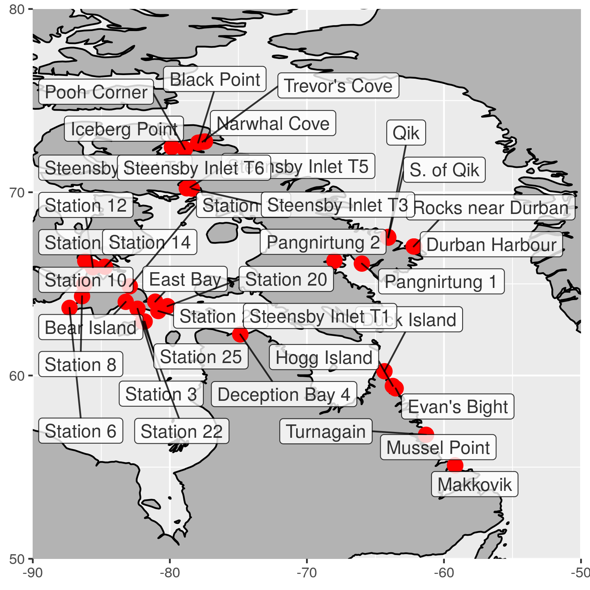

background-image: url(photo/alaria_1.jpg)

```{r setup, echo=FALSE}
options(htmltools.dir.version = FALSE, 
        eval = TRUE)
```

---
class: left
# What is known?

- Little is known of kelp in the Arctic

```{r, echo=F, fig.align="center"}
knitr::include_graphics("figure/kelp_question.png", dpi = 200)
```

---
# What is known?

- Trading in Alaria along Baffin Island coast

```{r, echo=F, fig.align="center"}
knitr::include_graphics("figure/alaria_trading.png", dpi = 300)
```

---
# What is known?

- Other examples?

---
# What is known?

- There should be other Laminariales sp.

```{r, echo=F, fig.align="center"}
knitr::include_graphics("figure/where_kelp.png", dpi = 300)
```

---
# Where are kelp in the Arctic and what drives their distribution?

- There must be kelp in the Arctic
- We don't know what the drivers of their distributions are
- The Arctic is changing quickly so we should figure this out ASAP

---
# ArcticKelp project

- Several different campaigns

```{r, echo=F, fig.align="center"}
knitr::include_graphics("figure/where_kelp.png", dpi = 300)
```

- Increasing ground truth obs

```{r, echo=F, fig.align="center"}
knitr::include_graphics("figure/alaria_trading.png", dpi = 300)
```

- Many sites visited




---
# Environmental conditions

## NAPA model - abiotic

## Bio-Oracle - biotic

# Modelling distribution

## RF steps
    
Which variables are important

# Results

Show general kelp cover
Drop Alaria if necessary

## Map

## Coastal stretch

## Error around predictions
Where in the errors are the distribution

---
# Acknowledgements

This research was undertaken thanks in part to funding from the Canada First Research Excellence Fund, through the Ocean Frontier Institute.

---
class: inverse
# References

<!-- --- -->
<!-- background-image: url(photo/agarum_1.JPG) -->
<!-- background-position: 50% 50% -->
<!-- class: center, bottom, inverse -->

<!-- --- -->
<!-- background-image: url(photo/agarum_1.JPG) -->
<!-- background-size: cover -->
<!-- class: center, bottom, inverse -->

<!-- --- -->

<!--   # R Plots -->

<!--   ```{r cars, fig.height=4, dev='svg'} -->
<!-- par(mar = c(4, 4, 1, .1)) -->
<!-- plot(cars, pch = 19, col = 'darkgray', las = 1) -->
<!-- abline(fit, lwd = 2) -->
<!-- ``` -->

<!-- --- -->

<!--   # Tables -->

<!--   If you want to generate a table, make sure it is in the HTML format (instead of Markdown or other formats), e.g., -->

<!-- ```{r} -->
<!-- knitr::kable(head(iris), format = 'html') -->
<!-- ``` -->

<!-- --- -->

<!--   ```{r out.width='100%', fig.height=6, eval=require('leaflet')} -->
<!-- library(leaflet) -->
<!-- leaflet() %>% addTiles() %>% setView(-93.65, 42.0285, zoom = 17) -->
<!-- ``` -->

<!-- --- -->

<!--   ```{r eval=require('DT'), tidy=FALSE} -->
<!-- DT::datatable( -->
<!--   head(iris, 10), -->
<!--   fillContainer = FALSE, options = list(pageLength = 8) -->
<!-- ) -->
<!-- ``` -->
